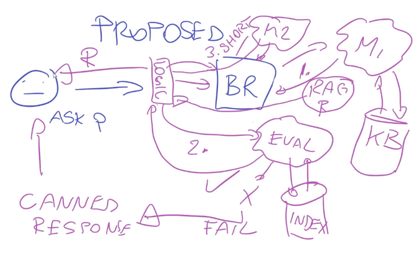
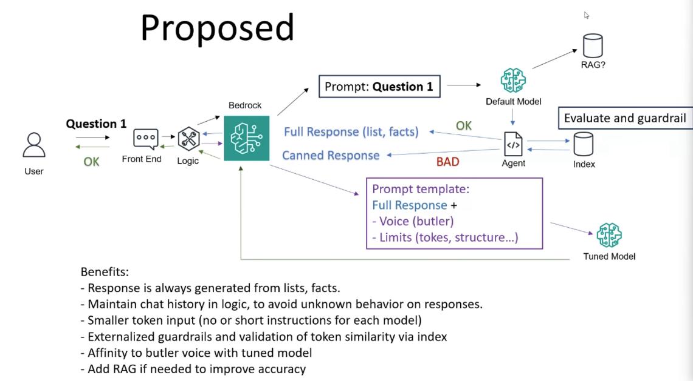

# 
- Design design design. think of you project as a system and as a free language programming.
- Use project files! lile examples.md. Divide examples to sub-context examples (E.g for each state!) Include scoring for the examples, to provide adjustments for what we wish.
- Use prompt / example enhancement: use a model to create a large number of those. Eventually when I have the prompt.md file or example file(s) ready, I can ask for improvement ontop of them.
- Use state / machine design for your agent
- Include special prompts / cases to debug.

- .
   Here you can note that when aimming for a certain design, alot of the time you need more than the main thread of the agent providing the service, and more than the guradrails in the in-out of the system, you need a logic layer that "saves" the state of the conversasion, and understands it rather than keep sending all the conversasion again back&forth.
   Additionally you may want a second agent summarising the inputs or the responses. Maybe an evaluation layer to consider whether the output matches the criteria.
- 
